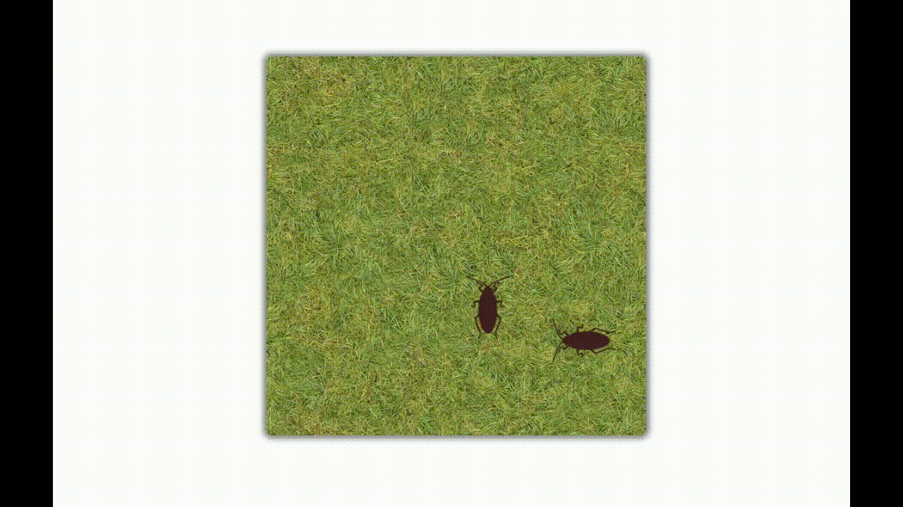

# Exercício animação Web I

## Descrição
Este projeto consiste em uma animação feita com HTML, CSS e JavaScript, onde são simulados os movimentos de baratas. A atividade tem como objetivo explorar técnicas de animação utilizando essas tecnologias. 

___

## Demonstração

Para visualizar a animação, acesse o [Projeto no CodePen](https://codepen.io/leonardocunha1/pen/vYwEXNX)

