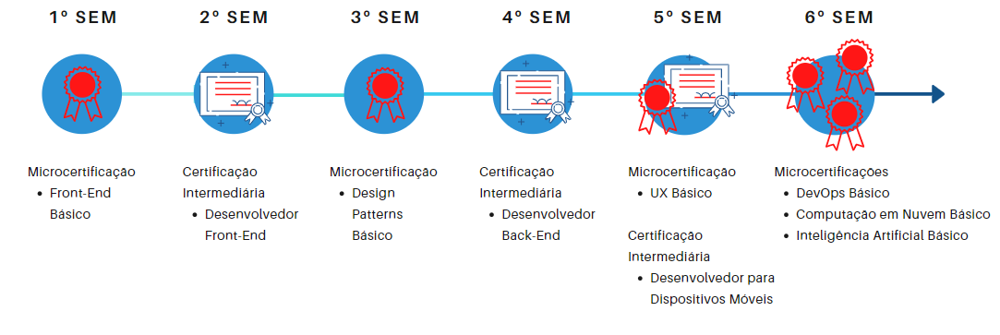

# Meu Currículo Vitae

Este projeto do desenvolvimento de um currículo trata-se de uma atividade proposta na matéria Web I do curso de D.S.M da Fatec Franca. Para isso, foram utilizadas algumas linguagens, tanto de marcação quanto de programação, como HTML, CSS e JS.

## 💻 [Link do site online e funcionando](https://leonardocunha1.github.io/exercicios-faculdade/2024/DSM/1%C2%B0Semestre/Web%20I/Curriculo-html-nao-respnsivo/)


## 🚀 Código-fonte e imagens utilizadas no desenvolvimento do site

Como dito anteriormente, as linguagens utilizadas foram:
- HTML
- CSS
- Javascript

#### 📋 Código fonte

De que coisas você precisa para instalar o software e como instalá-lo?

```
<!DOCTYPE html>
<html lang="pt-BR">
<head>
    <meta charset="UTF-8">
    <meta name="viewport" content="width=device-width, initial-scale=1.0">
    <title>Document</title>
    <link rel="stylesheet" href="style.css">
</head>
<body>
    <section class="top">
        <div class="container">
            <div class="icon">
                <p>Leonardo <span>°</span> CV</p>
            </div>
            <div class="menu">
                <ul>
                    <li><a href="#section2">Sobre mim</a></li>
                    <li><a href="https://github.com/leonardocunha1?tab=repositories" target="_blank">Portfólio</a></li>
                    <li><a href="#section1">Sobre o D.S.M</a></li>
                </ul>
            </div>
        </div>
    </section>

    <section class="banner-background">
        <div class="container">
            <div class="banner">
                <div class="banner-title">
                    <h1><span>Hello,</span><br>World!</h1>
                </div>
                <div class="banner-text">
                    <p>Olá, meu nome é Leonardo Cunha. Sou estudante do 1° semestre de D.S.M na Fatec Franca, apaixonado por tecnologia e inovação. Atualmente estou cursando Desenvolvimento de Software Multiplataforma e sou formado em Engenharia Civil. Estou sempre em busca de novos desafios e conhecimentos.</p>
                </div>
                <div class="banner-photo">
                    
                </div>
            </div>
        </div>
        <div class="custom-shape-divider-bottom-1709733019">
            <svg data-name="Layer 1" xmlns="http://www.w3.org/2000/svg" viewBox="0 0 1200 120" preserveAspectRatio="none">
                <path d="M0,0V46.29c47.79,22.2,103.59,32.17,158,28,70.36-5.37,136.33-33.31,206.8-37.5C438.64,32.43,512.34,53.67,583,72.05c69.27,18,138.3,24.88,209.4,13.08,36.15-6,69.85-17.84,104.45-29.34C989.49,25,1113-14.29,1200,52.47V0Z" opacity=".25" class="shape-fill"></path>
                <path d="M0,0V15.81C13,36.92,27.64,56.86,47.69,72.05,99.41,111.27,165,111,224.58,91.58c31.15-10.15,60.09-26.07,89.67-39.8,40.92-19,84.73-46,130.83-49.67,36.26-2.85,70.9,9.42,98.6,31.56,31.77,25.39,62.32,62,103.63,73,40.44,10.79,81.35-6.69,119.13-24.28s75.16-39,116.92-43.05c59.73-5.85,113.28,22.88,168.9,38.84,30.2,8.66,59,6.17,87.09-7.5,22.43-10.89,48-26.93,60.65-49.24V0Z" opacity=".5" class="shape-fill"></path>
                <path d="M0,0V5.63C149.93,59,314.09,71.32,475.83,42.57c43-7.64,84.23-20.12,127.61-26.46,59-8.63,112.48,12.24,165.56,35.4C827.93,77.22,886,95.24,951.2,90c86.53-7,172.46-45.71,248.8-84.81V0Z" class="shape-fill"></path>
            </svg>
        </div>
        <div class="contact-area">
            <a href="https://github.com/leonardocunha1" target="_blank"
              ></a>
            <a href="https://www.instagram.com/leohcunha/" target="_blank"
              ></a>
            <a href="linkedin.com/in/leonardo-cunha-8a6170263" target="_blank"
              ></a>
            <a href="https://wa.me/5516988753083" target="_blank"
              ></a>
          </div>
    </section>


    <section class="my-projects">
        <div class="container">
            <h1 class="project-title" id="parte-1">Meus projetos mais legais</h1>
            <div class="projects-area">
                <div class="project-area">
                    <div class="project-area-content">
                        
                        <h1>Diiner Burger</h1>
                        <p>Protótipo de uma hamburgueria (P.I da faculdade e está em construção ainda)</p>
                    </div>
                    <a href="https://leonardocunha1.github.io/exercicios-faculdade/2024/DSM/1%C2%B0Semestre/P.I%20Faculdade" target="_blank">Saiba mais</a href="">
                </div>
                <div class="project-area">
                    <div class="project-area-content">
                        
                        <h1>Projeto Awax</h1>
                        <p>Protótipo de uma empresa fictícia</p>
                    </div>
                    <a href="https://leonardocunha1.github.io/exercicios-cursos/2023/HTML-CSS/awax" target="_blank">Saiba mais</a href="">
                </div>
                <div class="project-area">
                    <div class="project-area-content">
                        
                        <h1>StarBuck's <br> Inspiration</h1>
                        <p>Inspiração de um site da Starbucks</p>
                    </div>
                    <a href="https://leonardocunha1.github.io/exercicios-cursos/2023/HTML-CSS/starbucks" target="_blank">Saiba mais</a href="">
                </div>
            </div>
        </div>
    </section>

    <section class="about-me" id="section2">
        <div class="container">
            <h1 class="about-me-h1">Sobre mim</h1>
            <div class="about-me-2">
                <div class="about-me-text">
                    <p>Sou um jovem de 26 anos formado em Engenharia Civil pela Universidade de Franca que adora estudar, tecnologia, praticar esportes, animais, jogos, séries e filmes. Estou imerso neste mundo da programação pois é algo que eu peguei um carinho e gosto enorme ao fazer 1 ano de Análise e Desenvolvimento de Sistemas (ADS) também pela Fatec Franca. Como eu gostei mais da área prática de programação, optei por sair do ADS e entrar no Desenvolvimento de Software Multiplataforma (DSM) onde o foco na elaboração de softwares é consideravelmente maior. Atualmente, estou no primeiro semestre de DSM e também realizei/realizo cursos extracurriculares de HTML, CSS, Javascript e Inglês. Minha vontade, após acabar o curso de JS, é aprender um framework como o React, aprender a prototipar sites com o Figma e também mergulhar no Node.js que, por ter formação em Engenharia Civil e ser relativamente bom em lógica, acredito que irei gostar bastante de lidar com os desafios de um desenvolvedor back-end.</p>
                    <p>Além do motivo mencionado anteriormente pela escolha do DSM, uma das caraterísticas do curso que chamou muita atenção foi a idade dele que, por ser muito recente, está com a grade muito atualizada e, com isso, fica de acordo com as necessidades atuais das empresas. As microcertificações também foi um ponto, entre os diversos, que merece destaque. A cada semestre é liberada uma microcertificação, de acordo com as materías aprendidas no semestre, ao aluno o que facilita a entrada no mercado de trabalho.</p>
                </div>
                <div class="about-me-skills">
                    <div class="about-me-hardskills">
                        <h1>Meus conhecimentos</h1>
                        <div class="about-me-hardskills-content">
                            <p>Conhecimentos sólidos de HTML e CSS</p>
                            <p>Redijo textos com qualidade</p>
                            <p>Conhecimento mediano em Javascript</p>
                            <p>Conhecimento mediano em Excel/VBA</p>
                            <p>Conhecimento de básico a intermediário em Inglês</p>
                            <p>Noções básicas de modelagem de banco de dados</p>
                            <p>Noções básicas de metologia ágil KANBAN</p>
                        </div>
                    </div>
                    <div class="about-me-softskills">
                        <h1>Minhas habilidades</h1>
                        <div class="about-me-softskills-content">
                            <p>Proativo</p>
                            <p>Resiliente</p>
                            <p>Amigável e Sociável</p>
                            <p>Criativo</p>
                            <p>Pensamento positivo</p>
                        </div>
                    </div>
                </div>
            </div>
            <div class="about-me-course"></div>
        </div>
    </section>

    <section class="about-course" id="section1">
        <div class="container">
            <div class="about-DSM-j">
                <h1>Sobre o D.S.M</h1>
                <div class="about-DSM-just">
                    <p>O Curso em Desenvolvimento de Software Multiplataforma nas FATEC's apresenta as seguintes inovações que buscam alinhar o conteúdo oferecido ao que é demandado pelo mercado e às necessidades específicas do público atendido:</p>
                    <ul>
                        <li>trata-se de uma formação tecnológica voltada para o desenvolvimento, de software;  </li>
                        <li>conteúdo alinhado ao que é requerido pelo mercado, em especial em relação a novas tecnologias como IOT, Mobile, Inteligência Artificial, Nuvem, entre outros; </li>
                        <li>metodologias ágeis e aprendizagem por projetos, com foco em resolução de problemas e desafios reais, de forma a aliar a prática e o desenvolvimento de habilidades socioemocionais, como comunicação, trabalho em equipe, autogestão e protagonismo do aluno; </li>
                        <li>flexibilização do currículo, com parte das aulas oferecidas de forma remota, principalmente no último semestre, o que permitirá ao aluno deslocamento para outras localidades e uma inserção facilitada no mercado de trabalho; </li>
                        <li>microcertificações e certificações intermediárias, que visam comunicar ao setor produtivo as habilidades adquiridas pelo estudante, aumentando suas chances de empregabilidade; valorizar a trajetória já percorrida pelo aluno; estimular o estudante a continuar os estudos e aprimorar a avaliação da própria instituição;   </li>
                        <li>construção de Portfólio Digital do aluno durante todos os semestres, sendo que os projetos do quarto, quinto e sexto semestre também serão utilizados para substituir o Trabalho de Graduação. O Portfólio Digital estimula o aprimoramento prático dos estudantes e é valorizado pelo mercado.</li>
                    </ul>
                </div>
            </div>


            <div class="about-DSM-grade">
                <h1 class="about-DSM-title">Grade do curso</h1>
                <div class="about-DSM">
                    <div class="about-DSM-sem">
                        <h1>1° Semestre</h1>
                        <p>Modelagem de Banco de Dados</p>
                        <p>Desenvolvimento Web I</p>
                        <p>Algoritmo e Lógica de Programação</p>
                        <p>Engenharia de Software I</p>
                        <p>Design Digital</p>
                        <p>S.O e Redes de Computadores</p>
                    </div>
                    <div class="about-DSM-sem">
                        <h1>2° Semestre</h1>
                        <p>Banco de Dados Relacional</p>
                        <p>Desenvolvimento Web II</p>
                        <p>Técnicas de Programação I</p>
                        <p>Engenharia de Software II</p>
                        <p>Estrutura de Dados</p>
                        <p>Matemática para Computação</p>
                    </div>
                    <div class="about-DSM-sem">
                        <h1>3° Semestre</h1>
                        <p>Banco de Dados Não-Relacional</p>
                        <p>Desenvolvimento Web III</p>
                        <p>Técnicas de Programação II</p>
                        <p>Gestão Ágil de Projetos de Software</p>
                        <p>I.H.C</p>
                        <p>Álgebra Linear</p>
                        <p>Inglês I</p>
                    </div>
                    <div class="about-DSM-sem">
                        <h1>4° Semestre</h1>
                        <p>Integração e Entrega Contínua</p>
                        <p>Laboratório de Des. Web</p>
                        <p>Programação para Dispositivos Móveis I</p>
                        <p>Internet das Coisas e Aplicações</p>
                        <p>Experiência do Usuário</p>
                        <p>Estatística Aplicada</p>
                        <p>Inglês II</p>
                    </div>
                    <div class="about-DSM-sem">
                        <h1>5° Semestre</h1>
                        <p>Segurança no Desenvolvimento de Aplicações</p>
                        <p>Lab. de Des. p/ Dispositivos Móveis</p>
                        <p>Programação para Dispositivos Móveis II</p>
                        <p>Aprendizagem de Máquina</p>
                        <p>Computação em Nuvem I</p>
                        <p>Fundamento da Redação Técnica</p>
                        <p>Inglês III</p>
                    </div>
                    <div class="about-DSM-sem">
                        <h1>6° Semestre</h1>
                        <p>Mineração de dados</p>
                        <p>Lab. de Des. Multiplataforma</p>
                        <p>Qualidade e Teste de Software</p>
                        <p>Processamento de Linguagem Natural</p>
                        <p>Computação em Nuvem II</p>
                        <p>Ética Profissional e Patente</p>
                        <p>Inglês IV</p>
                    </div>
                </div>

            </div>

            <div class="about-DSM-cert">
                <h1 class="about-DSM-cert-h1">Microcertificações do Curso</h1>
                
            </div>
        </div>
    </section>

    <script src="script.js"></script>
</body>
</html>
```
#### 📷 Imagens utilizadas
1. Minha foto

2. Foto das microcertificações do curso de DSM


## 🖼 Prints do site

